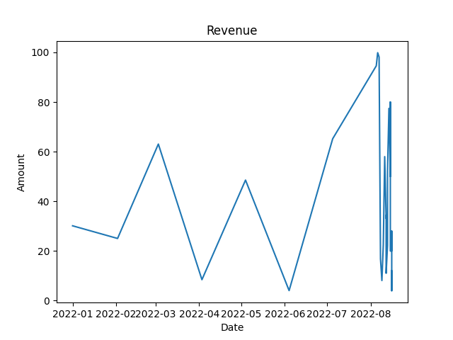

<a name="readme-top"></a>

[![LinkedIn][linkedin-shield]][linkedin-url]

<br />
<div align="center">
  <a href="https://github.com/othneildrew/Best-README-Template">
    
  </a>

  <h3 align="center">Superpy :smile:</h3>

  <p align="center">
    A CLI Application for Supermarkets!
    <br />
    <a href="https://github.com/Chrisztiaan/Superpy"><strong>Explore the docs »</strong></a>
    <br />
    <br />
    <a href="https://github.com/Chrisztiaan/Superpy/issues">Report Bug</a>
    ·
    <a href="https://github.com/Chrisztiaan/Superpy/issues">Request Feature</a>
  </p>
</div>


<!-- TABLE OF CONTENTS -->
<details>
  <summary>Table of Contents</summary>
  <ol>
    <li>
      <a href="#about-the-project">About The Project</a>
    </li>
    <li>
      <a href="#getting-started">Getting Started</a>
        <ul>
            <li><a href="#Python-and-Pip">Python and Pip</a></li>
            <li><a href="#Requirements">Requirements</a></li>
        </ul>
    </li>
    <li>
      <a href="#Usage">Usage</a></li>
        <ul>
          <li><a href="#Intro">Intro</a></li>
          <li><a href="#Commands">Commands</a></li>
            <ul>
              <li><a href="#Buy">Buy</a></li>
              <li><a href="#Sell">Sell</a></li>
              <li><a href="#Delete">Delete</a></li>
              <li><a href="#Inventory">Inventory</a></li>
              <li><a href="#Sold">Sold</a></li>
              <li><a href="#Revenue">Revenue</a></li>
              <li><a href="#Profit">Profit</a></li>
              <li><a href="#Report">Report</a></li>
              <li><a href="#Advance">Advance</a></li>
              <li><a href="#Set-Date">Set Date</a></li>
              <li><a href="#Expired">Expired</a></li>
            </ul>
        </ul>
    </li>
    <li>
      <a href="#Winc-Report">Winc Report</a>
    </li>
  </ol>
</details>


<!-- ABOUT THE PROJECT -->
## About The Project

Superpy is a CLI application for supermarkets.

With Superpy you can do the following:
* Keep track of products bought
* Keep track of products sold
* Keep track of expired products
* Calculate profit and revenue
* Show profit and revenue in a graph

This way you have full control of your stock without having to rely on pen and paper :pencil2:

<p align="right">(<a href="#readme-top">back to top</a>)</p>

<!-- GETTING STARTED -->
## Getting Started

This is an example of how you may give instructions on setting up your project locally.
To get a local copy up and running follow these steps.

### Python and Pip

To use Superpy you need to have Python and Pip installed. Usually Pip is installed with python.
Here's how to check if you have python and pip installed:

Type in your terminal:

* Python :snake:

  ```sh
  python --version
  ```

* Pip

  ```sh
  pip --version
  ```

  If you get a version back for both, you are good to go! :smile:
  If not see below for help:
    * [https://www.python.org/downloads/](https://www.python.org/downloads)
    * [https://pypi.org/project/pip/](https://pypi.org/project/pip/)

### Requirements

When you have python and pip installed there are some more requirements you need to use Superpy.
You can easily install these requirements with the <a href=https://github.com/Chrisztiaan/Superpy/blob/main/requirements.txt>requirements.txt</a> file

Just use the below command in your terminal:
  ```sh
  pip install -r requirements.txt
  ```

<p align="right">(<a href="#readme-top">back to top</a>)</p>


<!-- USAGE -->
## Usage

Here I will describe how to use Superpy. 

### Intro

Before giving Superpy a command you will allways have to start with:
  ```sh
  py superpy.py
  ```
Followed by the command.

Every command has a help function. For example:
  ```sh
  py superpy.py inventory -h
  ```
Use this if you feel lost or need a reminder.

For faster use you can copy your last command by using the :arrow_up: key.

### Commands

Below is a list of all the commands :point_down::
* Buy
* Sell
* Delete
* Inventory
* Sold
* Revenue
* Profit
* Report
* Advance
* Set Date
* Expired

Let's dive in and have a closer look 1 by 1 :swimmer:

#### Buy

Use this command  to buy products for your supermarket.
Fill in the id, product name, price, expiration date and the amount of the product.

Example:
  ```sh
  py superpy.py buy 1002 "Bananas - Chiquita" 0.10 2022-09-01 60
  ```

#### Sell

Use this command to sell a product and remove it from the inventory.
Fill in the id, price and the amount your selling.

Example:
  ```sh
  py superpy.py sell 1002 0.20 30
  ```

<p align="right">(<a href="#readme-top">back to top</a>)</p>

#### Delete

Use this command to delete a product.
The amount you fill in will be removed from the inventory.
Use this for damaged goods or other exceptions.

Example:
  ```sh
  py superpy.py delete 1002 10
  ```

#### Inventory

Use this command to view the inventory.
Can be filtered by id or date.
To filter use the argument followed by the id/date.
In the example below we filter with two dates to filter all products that have been bought between these dates.

Example:
  ```sh
  py superpy.py inventory --date 2022-07-01 --date2 2022-08-01
  ```

Output:
  ```sh
╒══════╤═══════════════════╤════════════╤═════════╤═════════════════════╤══════════╕
│   id │ product_name      │ buy_date   │   price │ expiration_date     │   amount │
╞══════╪═══════════════════╪════════════╪═════════╪═════════════════════╪══════════╡
│    1 │ Sauce - Rosee     │ 2022-07-31 │     2   │ 2023-07-17          │       50 │
├──────┼───────────────────┼────────────┼─────────┼─────────────────────┼──────────┤
│    2 │ Mudslide          │ 2022-07-31 │    37   │ 2022-10-09          │       54 │
├──────┼───────────────────┼────────────┼─────────┼─────────────────────┼──────────┤
│   41 │ Basil - Fresh     │ 2022-07-16 │    36   │ 2023-04-08          │        3 │
├──────┼───────────────────┼────────────┼─────────┼─────────────────────┼──────────┤
│ 1000 │ Apples - Jonagold │ 2022-07-16 │     0.3 │ 2022-12-31 00:00:00 │       40 │
╘══════╧═══════════════════╧════════════╧═════════╧═════════════════════╧══════════╛
  ```

<p align="right">(<a href="#readme-top">back to top</a>)</p>

#### Sold

Use this command to view the sold stock.
Will display today by default but can be filtered by date.
To filter use the argument followed by the date.

Example:
  ```sh
  py superpy.py sold --date 2022-08-15 --date2 2022-08-16
  ```

Output:
  ```sh
  ╒══════╤═════════════╤══════════╤══════════════╤═══════════╤══════════╕
│   id │ sell_date   │   amount │   sell_price │   revenue │   profit │
╞══════╪═════════════╪══════════╪══════════════╪═══════════╪══════════╡
│ 1001 │ 2022-08-15  │       50 │          2   │       100 │       50 │
├──────┼─────────────┼──────────┼──────────────┼───────────┼──────────┤
│ 1000 │ 2022-08-15  │       80 │          1.3 │       104 │       80 │
├──────┼─────────────┼──────────┼──────────────┼───────────┼──────────┤
│ 1000 │ 2022-08-15  │       20 │          1.3 │        26 │       20 │
├──────┼─────────────┼──────────┼──────────────┼───────────┼──────────┤
│ 1001 │ 2022-08-16  │       40 │          1   │        40 │       20 │
├──────┼─────────────┼──────────┼──────────────┼───────────┼──────────┤
│ 1001 │ 2022-08-16  │       40 │          1   │        40 │       20 │
├──────┼─────────────┼──────────┼──────────────┼───────────┼──────────┤
│ 1000 │ 2022-08-16  │       40 │          1   │        40 │       28 │
├──────┼─────────────┼──────────┼──────────────┼───────────┼──────────┤
│ 1001 │ 2022-08-16  │       40 │          0.5 │        20 │        4 │
├──────┼─────────────┼──────────┼──────────────┼───────────┼──────────┤
│ 1001 │ 2022-08-16  │       60 │          0.6 │        36 │       12 │
╘══════╧═════════════╧══════════╧══════════════╧═══════════╧══════════╛
  ```

#### Revenue

Use this command to calculate the revenue, today is standard but you can filter by date.

Example:
  ```sh
  py superpy.py revenue --date 2022-08-15 --date2 2022-08-16
  ```

<p align="right">(<a href="#readme-top">back to top</a>)</p>

#### Profit

Use this command to calculate the profit, today is standard but you can filter by date.

Example:
  ```sh
  py superpy.py profit --date 2022-08-15 --date2 2022-08-16
  ```

#### Report

Use this command to view a graph of profit or revenue.
First define wich one you want to see a graph from with "type" (Profit or Revenue).
Second fill in the start and end date for the period with --date and --date2.
Not filling this will show a graph for all sales ever made.

Example:
  ```sh
  py superpy.py report revenue --date 2022-08-15 --date2 2022-08-16
  ```

Output Example:


<p align="right">(<a href="#readme-top">back to top</a>)</p>

#### Advance

Use this command to travel through time by a number of days :watch:

Example:
  ```sh
  py superpy.py advance 1
  ```

#### Set Date

Use this command to travel through time to a certain date :watch:

Example:
  ```sh
  py superpy.py set_date 2022-08-17
  ```

#### Expired

Use this command to view all expired products.

Example:
  ```sh
  py superpy.py expired
  ```
Output Example:
  ```sh
╒══════╤══════════════════════════════════╤════════════╤═════════╤═══════════════════╤══════════╕
│   id │ product_name                     │ buy_date   │   price │ expiration_date   │   amount │
╞══════╪══════════════════════════════════╪════════════╪═════════╪═══════════════════╪══════════╡
│   11 │ Spice - Greek 1 Step             │ 2021-11-11 │      33 │ 2022-07-13        │        6 │
├──────┼──────────────────────────────────┼────────────┼─────────┼───────────────────┼──────────┤
│   57 │ Beef - Short Ribs                │ 2022-01-06 │      86 │ 2022-08-14        │       21 │
├──────┼──────────────────────────────────┼────────────┼─────────┼───────────────────┼──────────┤
│   80 │ Island Oasis - Peach Daiquiri    │ 2021-12-06 │      95 │ 2022-07-21        │       82 │
├──────┼──────────────────────────────────┼────────────┼─────────┼───────────────────┼──────────┤
│  154 │ Wine - Cave Springs Dry Riesling │ 2021-07-12 │      32 │ 2022-08-06        │       45 │
├──────┼──────────────────────────────────┼────────────┼─────────┼───────────────────┼──────────┤
│  165 │ Water Chestnut - Canned          │ 2021-10-09 │      50 │ 2022-08-01        │       92 │
├──────┼──────────────────────────────────┼────────────┼─────────┼───────────────────┼──────────┤
│  205 │ Bread - Granary Small Pull       │ 2022-04-15 │      52 │ 2022-06-28        │       70 │
├──────┼──────────────────────────────────┼────────────┼─────────┼───────────────────┼──────────┤
│  248 │ Stock - Veal, Brown              │ 2022-04-09 │      68 │ 2022-07-08        │       53 │
├──────┼──────────────────────────────────┼────────────┼─────────┼───────────────────┼──────────
  ```

<p align="right">(<a href="#readme-top">back to top</a>)</p>

## Winc Report

Included in the documents is a report that highlights three notable technical elements of the implementation.

Click to go there now :point_down:

<a href=https://github.com/Chrisztiaan/Superpy/blob/main/report.md>Report :raised_hands:</a>


<p align="right">(<a href="#readme-top">back to top</a>)</p>

<!-- MARKDOWN LINKS & IMAGES -->
[linkedin-url]: www.linkedin.com/in/christiaan-verlaan-86541610b/
[linkedin-shield]: https://img.shields.io/badge/-LinkedIn-black.svg?style=for-the-badge&logo=linkedin&colorB=555